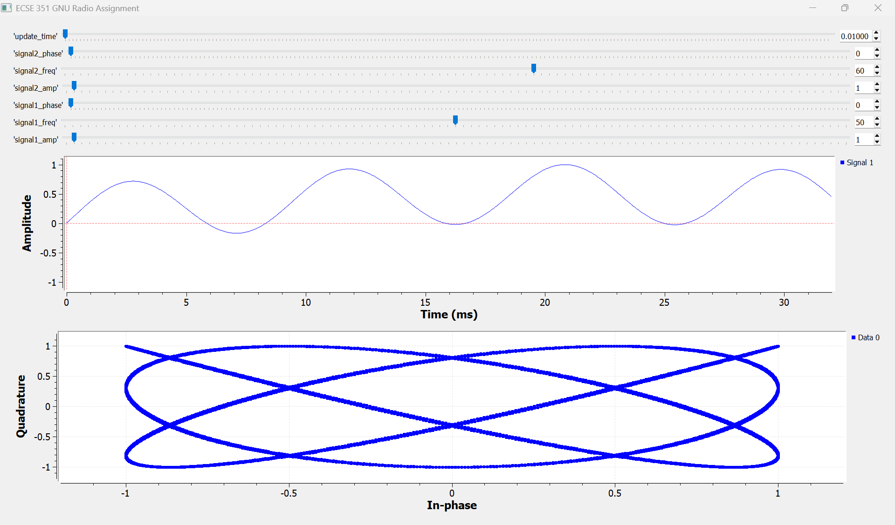

# ECSE_351_SmithJ_GNUradio

# Description
This assignment aims to recreate the Spring 2025 ECSE 351 Phase Lab in GNU Radio, including a GUI with options to change the amplitude, frequency, and phase of each signal. Both the time representation and phasor view will included.
This code attempts to recreate the phase lab by generating two independent signals, with variables accessible through the GUI. The multiplication of the signals is placed in a time domain view, and the two signals are also implemented in a phasor view with one signal being the in phase component and the other being the quadrature component.

### Features
- Time domain view of multiplied signals
- Phasor view of multiplied signals
- Variable amplitude, frequency, and phase of each signal within GUI
- Variable phasor update time in GUI
- Variable number of points in phasor view that mimics persistance (not changable in GUI)

### Results
Results will vary with all the parameters, but this is one of the results where a Lissajous figure has formed.

